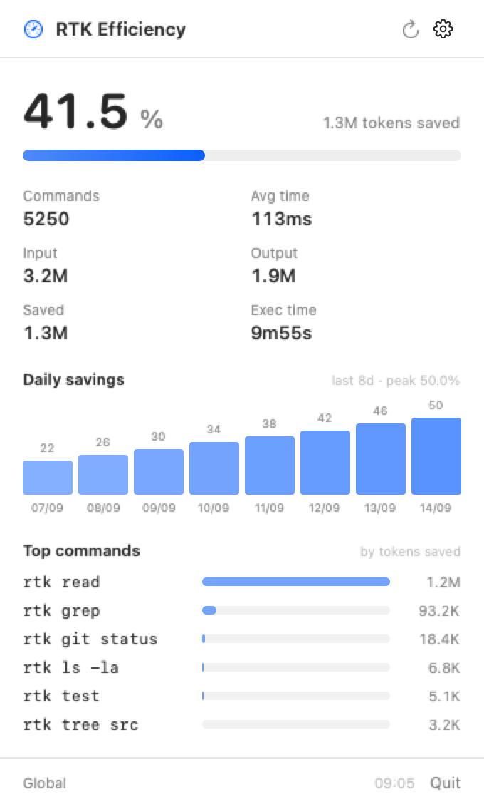
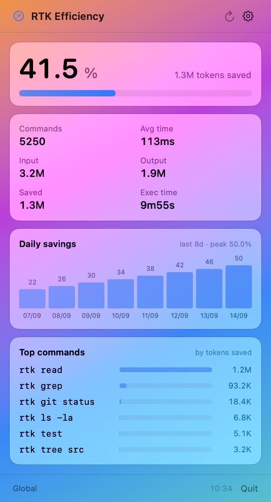

# RTK Meter

A macOS menu bar app for [rtk](https://github.com/rtk-ai/rtk) (Rust Token Killer): it shows your
token-savings efficiency in the status bar and the full breakdown in a click-through popover.
Refreshes every 60 seconds.



## Requirements

- macOS 13 or later
- Xcode Command Line Tools (`xcode-select --install`) — build only
- `rtk` installed and on the PATH

## Install

```bash
brew install christophecollet78/tap/rtk-meter
rtk-meter
```

That pours the prebuilt universal bundle — no Swift toolchain, no Apple Developer
account, and nothing for Gatekeeper to complain about, since Homebrew does not
quarantine formula downloads.

To put it in Launchpad as well:

```bash
ln -sfn "$(brew --prefix rtk-meter)/RTK Meter.app" ~/Applications/"RTK Meter.app"
```

## Build from source

```bash
git clone https://github.com/christophecollet78/rtk-meter.git
cd rtk-meter
./build.sh
cp -R "build/RTK Meter.app" ~/Applications/
open ~/Applications/"RTK Meter.app"
```

Needs the Xcode Command Line Tools (`xcode-select --install`); a full Xcode install is
not required. `build.sh` runs `swift build` and wraps the result into a universal
(arm64 + x86_64), ad-hoc signed bundle in `build/`. `brew install --HEAD` does the same
from the latest commit.

Pushing a `v*` tag builds this bundle in CI and publishes it as a release asset, which
is what the Homebrew formula installs.

Override the bundle metadata if you are packaging your own variant:

```bash
APP_NAME="Token Meter" BUNDLE_ID="com.example.tokenmeter" VERSION=1.1 ./build.sh
```

## Appearance

The report is drawn as translucent panels: Liquid Glass on macOS 26 and later, an
`NSVisualEffectView` material before that.

The system decides how translucent they are. The Liquid Glass slider in Appearance
settings (`NSGlassTintAmount`) picks clear glass below its midpoint and tinted glass
above, and the fill under each panel follows the whole range, so the slider changes
the panels rather than only their edges. Reduce Transparency replaces every panel
with an opaque fill, and Increase Contrast adds a border. The slider is re-read
through CFPreferences each time the popover opens, since `UserDefaults` caches other
domains for the life of a process and a long-running agent would otherwise never see
it move; the accessibility settings arrive as notifications and apply immediately.

"Translucent panels" in the gear menu opts out on its own, and is disabled while
Reduce Transparency is on, since that already decides the question.



The gradient above is the preview harness, not the app: glass only exists once the
window server composites it, so a design review needs a real window.
`PREVIEW_ONSCREEN=1` puts the view in one over a gradient and screenshots that
window alone:

```bash
PREVIEW_ONSCREEN=1 "build/RTK Meter.app/Contents/MacOS/RTKMeter" --render-preview glass.png
```

`PREVIEW_GLASS_TINT=0.0` … `1.0` overrides the slider for that render, so both ends
can be reviewed without touching a system setting.

## Updates

The app asks GitHub for the latest release five seconds after launch and every six
hours after that. When a newer version exists, a banner appears at the top of the
popover; installed from the tap, its button runs `brew upgrade` and then offers to
relaunch. Installed any other way, it links to the release instead. "Check for
Updates" in the gear menu asks immediately.

Nothing is sent anywhere: the check is one anonymous GET to
`api.github.com/repos/<repo>/releases/latest`, well inside the 60-per-hour limit.
A build with no tag reports version `0.0.0` and skips the check entirely rather
than claiming to be outdated.

## Settings

The gear menu in the popover covers refresh interval, menu bar percentage, launch at
login, an explicit `rtk` path, and a project scope (statistics for one directory, via
`rtk gain --project`). Everything is stored in the standard defaults domain, so it can
also be scripted:

```bash
defaults write local.rtkmeter refreshInterval -float 300
defaults write local.rtkmeter rtkPath /custom/bin/rtk
defaults write local.rtkmeter projectScope ~/code/my-project
defaults write local.rtkmeter showPercentage -bool false
defaults write local.rtkmeter useGlass -bool false
```

## What it shows

- **Status bar** — gauge symbol plus the average savings percentage
- **Popover** (left-click) — totals, a daily savings chart for the last 14 days,
  and the top commands ranked by tokens saved
- **Context menu** (right-click) — Refresh / Quit
- **Launch at login** — registers the app through `SMAppService`

Data comes from `rtk gain -f json -d`. The per-command table is parsed from the text
output of `rtk gain`, since the JSON renderer only exposes the summary and daily series;
if that layout changes, the section is omitted rather than showing wrong numbers.

## Layout

| Path | Role |
| --- | --- |
| `Sources/RTKMeter/Stats.swift` | Data model and formatting helpers |
| `Sources/RTKMeter/RTK.swift` | Locates and runs `rtk`, parses its output |
| `Sources/RTKMeter/Settings.swift` | Preferences, backed by `UserDefaults` |
| `Sources/RTKMeter/Updater.swift` | Release check, `brew upgrade`, relaunch |
| `Sources/RTKMeter/Glass.swift` | Panel materials and the accessibility settings |
| `Sources/RTKMeter/DetailView.swift` | SwiftUI popover |
| `Sources/RTKMeter/App.swift` | Status item, timer, popover hosting |
| `Sources/RTKMeter/PreviewRenderer.swift` | Offscreen PNG render of the popover |
| `Sources/RTKMeter/main.swift` | Entry point |

The binary doubles as its own screenshot tool, which is how CI checks the UI without a
display:

```bash
"build/RTK Meter.app/Contents/MacOS/RTKMeter" --render-preview popover.png
```

Pass a captured `rtk gain` output as a second argument to render the real command table,
or set `PREVIEW_UPDATE=1.4.0` to draw the update banner too.

The version comes from the git tag, so a released build always reports the version it
was published under. `REPOSITORY` and `FORMULA` decide where the update check looks —
override both when building a fork.

`rtk` is located by probing the usual install paths (Homebrew, Cargo, `~/.local/bin`) and
then falling back to `$SHELL -lc 'command -v rtk'`, because GUI apps do not inherit the
login shell PATH. Every invocation has a 15-second timeout and its output is drained on a
background queue, so a stuck or chatty `rtk` cannot freeze the menu bar.

## Contributing

Issues and pull requests are welcome. Keep to the existing style: no third-party
dependencies, and macOS 13 as the deployment floor.

## License

MIT
